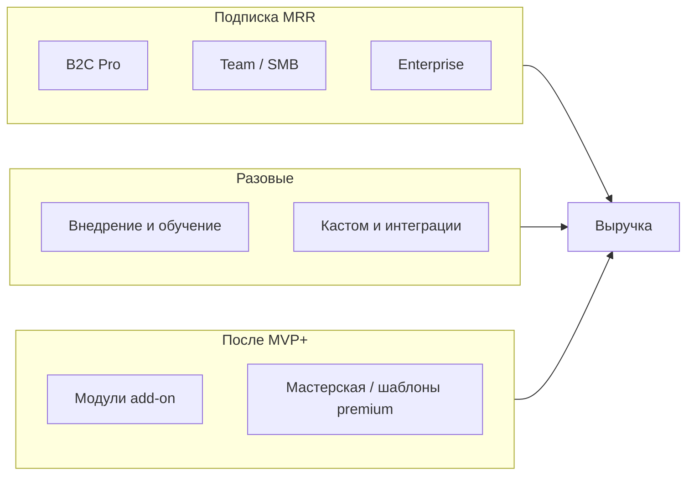

# Retrogen: бизнес-модель, прайс и план монетизации

> Документ для внутреннего планирования и переговоров с клиентами.  
> Ветка: `docs/pricing-business-model` (не связана с feature-ветками разработки UI).  
> Цифры — **рабочая модель** (допущения явно помечены); перед договором нужна калибровка под ваши затраты и юрлицо.

---

## 1. Что продаём

**Retrogen** — облачная (и опционально on-prem) платформа для **ретроспектив и фасилитации команд**: живая доска, стикеры, блоки ретро, синхронизация в реальном времени, отчёт после сессии, лобби комнат, доступ по паролю.

**Ценность для клиента:**

| Сегмент | Боль | Выгода Retrogen |
|--------|------|-----------------|
| **Банки (ВТБ, МТС Банк)** | Compliance, ИБ, запрет «случайных» SaaS | VPC / on-prem, SSO, аудит, SLA, российский контур |
| **Юрлица (IT, телеком, госсектор)** | Разрозненные Miro + Excel | Единый инструмент ретро, отчёты, action items |
| **Физлица / малые команды** | Дорогой Miro, нет «своего» | Дешевле, русский UX, шаблоны ретро |

**Стадия продукта:** MVP ~20–25% дорожной карты (`PLAN.md`). Монетизация опирается на **roadmap** (аккаунты, SSO, аналитика, мастерская) — часть модулей продаётся **сейчас как «ранний доступ»** с фиксированным SLA по срокам поставки.

---

## 2. Как зарабатываем (потоки выручки)

| Поток | Доля выручки (год 2, оценка) | Комментарий |
|-------|------------------------------|-------------|
| **Enterprise-лицензии** | 55–70% | ВТБ, МТС Банк, крупный B2B |
| **Team / Business SaaS** | 15–25% | Юрлица до 500 сотрудников |
| **B2C Pro** | 3–8% | Физлица, коучи, фриланс-фасилитаторы |
| **Внедрение, обучение** | 10–20% | Разово + продление поддержки |
| **Модули** | 5–15% | SSO, LLM-отчёты, compliance-архив |

---

## 3. Продуктовая линейка (пакеты и модули)

### 3.1. Базовые пакеты (подписка)

| Пакет | Аудитория | Что входит | Лимиты |
|-------|-----------|------------|--------|
| **Free** | Физлица, пилот | 1 фасилитатор, доска, лобби, экспорт MD/JSON | 3 активные комнаты, 8 участников/комната, история 30 дней |
| **Pro** | Физлица, менторы | Free + шаблоны, без водяного знака, приоритетная поддержка | 15 комнат, 25 участников, история 1 год |
| **Team** | Юрлица, отделы | Pro + общий workspace, роли, бренд шапки | до 15 лицензий, 50 участников/комната |
| **Business** | Юрлица, несколько команд | Team + SSO (опция), аналитика ретро, API read | до 50 лицензий, неограниченные комнаты |
| **Enterprise** | Банки, холдинги | Business + VPC/on-prem, SLA 99.5%, аудит-лог, DPA | по контракту, лицензии seat или site |

### 3.2. Модули (add-on, можно без полного Enterprise)

| Модуль | Код | Для кого | Цена (ориентир) |
|--------|-----|----------|-----------------|
| **Полный доступ к доске** | `CORE` | Все платные пакеты | Включён в Pro+ |
| **SSO / SAML + SCIM** | `IAM` | Юрлица, банки | +15% к лицензии или от 180 000 ₽/год |
| **Compliance-архив** | `ARCH` | Банки | от 240 000 ₽/год (хранение 3–7 лет, экспорт) |
| **Аналитика + AI-сводки** | `AI` | Team+ | от 120 000 ₽/год или +990 ₽/seat/мес |
| **Мастерская (шаблоны premium)** | `WS` | Team+ | от 49 000 ₽/год на организацию |
| **On-prem / частное облако** | `VPC` | ВТБ, МТС, госсектор | от 1 500 000 ₽/год + инфра клиента |
| **Интеграции (Jira, Confluence, VK Teams)** | `INT` | Business+ | от 200 000 ₽/год за 2 коннектора |
| **Фасилитатор Pro (обучение + сертификат)** | `EDU` | Внутри банка | 350 000–900 000 ₽ за поток 20 чел. |

**Полный доступ (All-in):** пакет **Enterprise All-in** = `CORE` + `IAM` + `ARCH` + `AI` + `WS` + `INT` + `VPC` — цена по прайсу банка (см. §4.3), обычно **скидка 12–18%** vs сумма модулей.

---

## 4. Прайс-лист для клиентов (₽, без НДС; с НДС ×1.22 для РФ юрлиц)

### 4.1. Физические лица (B2C)

| Тариф | Период | Цена | Эквивалент / мес |
|-------|--------|------|------------------|
| Free | — | 0 ₽ | 0 |
| **Pro** | месяц | 790 ₽ | 790 |
| **Pro** | год (−20%) | 7 590 ₽ | 633 |
| **Pro+** (AI-сводки личные, 5 комнат) | месяц | 1 290 ₽ | 1 290 |
| **Pro+** | год | 12 390 ₽ | 1 033 |

*Допущение:* конверсия Free→Pro 2–4%, ARPU платящих ~700 ₽/мес.

### 4.2. Юридические лица (B2B, стандарт)

Цены за **организацию / год**, оплата поквартально +10%.

| Тариф | До seats | Год | Месяц (экв.) | Внедрение (разово) |
|-------|----------|-----|--------------|-------------------|
| **Team S** | 10 | 89 000 ₽ | ~7 400 | 0 (self-serve) |
| **Team M** | 25 | 179 000 ₽ | ~14 900 | 30 000 ₽ |
| **Business** | 50 | 399 000 ₽ | ~33 250 | 80 000 ₽ |
| **Business+** | 100 | 649 000 ₽ | ~54 100 | 120 000 ₽ |
| **Доп. seat** | сверх лимита | 4 900 ₽/seat/год | — | — |

**Модули для B2B (дополнительно к тарифу):**

| Модуль | Год |
|--------|-----|
| IAM (SSO) | 180 000 ₽ |
| AI | 120 000 ₽ |
| ARCH | 240 000 ₽ |
| WS | 49 000 ₽ |
| INT (2 системы) | 200 000 ₽ |

### 4.3. Крупные клиенты: ВТБ, МТС Банк и аналоги

Пакеты под **ИБ + закупочный регламент** (годовой контракт, NDA, пилот 60–90 дней).

| Пакет | Описание | Год (лицензия) | Пилот 90 дней | Внедрение |
|-------|----------|----------------|---------------|-----------|
| **Bank Pilot** | 1 дивизион, до 200 seats, VPC по согласованию, CORE+IAM | 1 200 000 ₽ | 350 000 ₽ (зачёт 50% в годовой) | 400 000 ₽ |
| **Bank Standard** | до 800 seats, CORE+IAM+ARCH+AI | 2 800 000 ₽ | 600 000 ₽ | 800 000 ₽ |
| **Bank Enterprise** | site / 2000+ seats, All-in + VPC + SLA 99.9% | 4 500 000 – 7 500 000 ₽ | 900 000 ₽ | 1 200 000 – 2 000 000 ₽ |
| **Поддержка L2 24×5** | опция | 18% от лицензии/год | — | — |
| **Выделенный фасилитатор-консультант** | 12 сессий/год | — | — | 600 000 ₽/год |

**Ориентир по двум якорным клиентам (год 1, если закрыты оба):**

| Клиент | Вероятный пакет | Выручка год 1 (лицензия + внедрение) |
|--------|-----------------|--------------------------------------|
| **ВТБ** (1 направление Agile/IT) | Bank Standard | ~3 600 000 ₽ |
| **МТС Банк** | Bank Pilot → Standard | ~2 000 000 – 3 200 000 ₽ |
| **Прочие юрлица** (5× Team M) | — | ~895 000 ₽ |
| **B2C** (500 Pro) | — | ~3 800 000 ₽/год (верхняя оценка) |

---

## 5. Экономика для создателей (выгода и прибыль)

### 5.1. Структура затрат (месяц, допущение: команда 2–3 человека + аутсорс)

| Статья | ₽/мес | Примечание |
|--------|-------|------------|
| Облако (prod + staging) | 25 000 – 45 000 | до VPC клиентов |
| Юрист, бухгалтерия | 25 000 | |
| Поддержка / часть FOT | 80 000 – 150 000 | |
| Маркетинг, конференции | 30 000 – 80 000 | |
| Резерв ИБ, пентест (аморт.) | 20 000 | |
| **Итого OPEX** | **180 000 – 320 000** | без полной зарплаты founders |

*При найме 2 dev + 1 sales полный FOT добавьте **450 000 – 700 000 ₽/мес**.*

### 5.2. Сценарии прибыли (12 месяцев, после выхода на коммерцию)

| Сценарий | MRR к концу года | Выручка год | OPEX год | **Прибыль до налога** |
|----------|------------------|-------------|----------|------------------------|
| **Консервативный** | 180 000 | 1 350 000 | 2 400 000 | **−1 050 000** (инвестиционная фаза) |
| **Базовый** | 520 000 | 4 200 000 | 3 600 000 | **+600 000** |
| **Оптимистичный** (ВТБ + МТС + 3 B2B) | 1 100 000 | 9 800 000 | 5 500 000 | **+4 300 000** |

**Выгода создателей (немонетарная):**

- IP и код остаётся у вас; enterprise-контракты **привязаны к roadmap**, а не к разовой разработке.
- Повторяемый продукт: одно внедрение в банк → шаблон для **ВТБ/МТС/дочек**.
- Маржа на модулях **70–85%** после выхода на SaaS (мало переменных затрат на seat).

**Точка безубыточности (базовые допущения):** ~**290 000 ₽ MRR** (~3,5 млн ₽/год выручки) при OPEX ~300k/мес.

---

## 6. План по срокам (дорожная карта монетизации)

### Месяц 1 — «Упаковка и пилот»

| Неделя | Продукт | Продажи | Метрики |
|--------|---------|---------|---------|
| 1–2 | Зафиксировать MVP для демо; one-pager, прайс (этот документ) | Список 20 целевых юрлиц + контакт ВТБ/МТС | 2 демо |
| 3–4 | Пилотный контур staging; NDA шаблон | Пилот **Bank Pilot** (письмо intent) | 1 LOI / пилот |

**Цель MRR:** 0 → 50 000 ₽ (первые Team S).

### Месяцы 2–3 — «Пилот и первые деньги»

| Задача | Срок |
|--------|------|
| Закрытие пилота 90 дней (1 банк или 2 B2B) | М2 |
| Billing (счёт для юрлиц, эквайринг B2C) | М2 |
| SSO (модуль IAM) — MVP для банка | М3 |
| **Цель MRR:** 150 000 – 350 000 ₽ | М3 |

### Месяцы 4–6 — «Масштаб B2B»

| Задача | Срок |
|--------|------|
| Конверсия пилота ВТБ/МТС в годовой контракт | М4–М5 |
| 5–10 платящих Team/Business | М6 |
| ARCH + AI в продажу | М5 |
| **Цель MRR:** 500 000 – 800 000 ₽ | М6 |

### Месяцы 7–12 — «Enterprise и модули»

| Задача | Срок |
|--------|------|
| 2 enterprise-логотипа в кейсах | М9 |
| Мастерская (WS) — каталог шаблонов | М8 |
| On-prem/VPC playbook | М10 |
| **Цель MRR:** 800 000 – 1 200 000 ₽ | М12 |
| **Выручка за год:** 4–10 млн ₽ (сценарий) | |

### Год 2+ (18–24 мес.)

- Партнёрский канал (Agile-коучи, интеграторы) — 15% комиссии.
- Marketplace шаблонов (rev-share 70/30).
- Региональные копии прайса (СНГ, если нужен compliance).

---

## 7. Сводная таблица: кому что предлагать

| Клиент | Рекомендуемый пакет | Первый шаг | Целевой чек год 1 |
|--------|---------------------|------------|-------------------|
| **ВТБ** | Bank Standard → Enterprise | Пилот 90 дней, 1 ЦАГ/департамент | 2,8–4,5 млн ₽ |
| **МТС Банк** | Bank Pilot | Пилот + SSO | 1,5–3,2 млн ₽ |
| **Другие банки / финтех** | Bank Pilot | Демо + ИБ-опросник | 1,2–2,8 млн ₽ |
| **IT-юрлица 50–500 чел.** | Business / Business+ | Team trial 14 дней | 400–650 тыс. ₽ |
| **Стартапы, студии** | Team S / M | Self-serve | 89–179 тыс. ₽ |
| **Физлица (коуч, SCRUM)** | Pro / Pro+ | Free → Pro | 7,6–12,4 тыс. ₽ |

---

## 8. Риски и как заложить в цену

| Риск | Влияние | Митигация в прайсе |
|------|---------|-------------------|
| Долгий цикл закупки в банке | Кассовый разрыв | Пилот с предоплатой 70% |
| ИБ-требования | +2–4 мес. разработки | Модуль VPC дороже на 40% |
| Конкуренция Miro | Давление на цену | Упор на compliance + ретро «из коробки» |
| MVP 25% | Churn после пилота | SLA roadmap в контракте, модуль «ранний доступ» |

---

## 9. Следующие шаги (операционные)

1. Утвердить юрлицо и НДС-политику.
2. Согласовать с AHTu21 **минимальную цену пилота** для банков (не ниже 300k за 90 дней).
3. Подготовить **КП на 2 страницы** из §4.3 для ВТБ и МТС Банк.
4. Вынести в `PLAN.md` или отдельный тикет: billing, org/workspace, лимиты Free — без этого прайс не технически enforceable.

---

## 10. История документа

| Версия | Дата | Автор | Изменение |
|--------|------|-------|-----------|
| 0.1 | 2026-05-22 | docs/pricing-business-model | Первая редакция модели и прайса |

*Вопросы и правки — в PR из ветки `docs/pricing-business-model`.*
