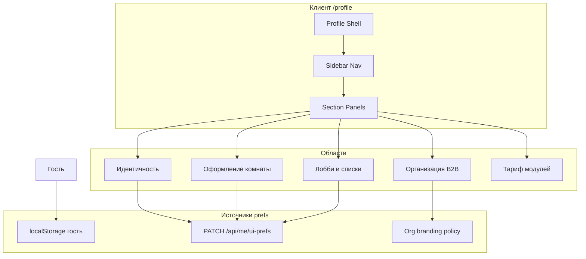
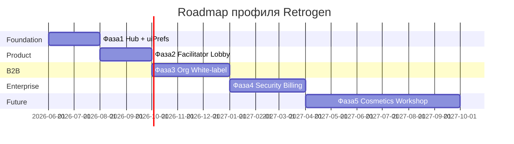

# Стратегия страницы профиля Retrogen

> Ветка: `docs/profile-strategy`  
> Связанные документы: [`PLAN.md`](../PLAN.md) §12, [`BUSINESS_MODEL_AND_PRICING.md`](./BUSINESS_MODEL_AND_PRICING.md), [`COMMUNITY_ROADMAP.md`](./COMMUNITY_ROADMAP.md)  
> Дата: 2026-05-22

---

## 1. Цель документа

Спроектировать **идеальную и масштабируемую** страницу профиля / настроек для Retrogen с учётом:

- специфики продукта (ретро, фасилитатор, комната, лобби, отчёты);
- бизнес-модели (B2C, Team, Enterprise, банки ВТБ / МТС Банк);
- текущего кода (~25% roadmap) и **будущего** (мастерская, косметика, SSO, org-branding);
- **персонализации** под пользователя и **white-label** под организацию.

---

## 2. Исследование рынка (РФ и мир)

### 2.1. Глобальные паттерны (2024–2026)

| Продукт / паттерн | Сильные стороны | Слабые для Retrogen |
|-------------------|-----------------|---------------------|
| **Notion / Linear** — sidebar + секции | Масштаб, ясная навигация, sticky save | Нет «ретро-контекста» |
| **Slack / Discord** — профиль + настройки workspace | Разделение личного и org | Сложный для гостей |
| **GitHub Settings** | Danger zone, security отдельно | Перегруз для фасилитатора |
| **Miro** — account + team admin | Близко по домену (доска) | Дорого, слабый фокус на ретро-отчёт |
| **EasyRetro / Retrium / Parabol** | Ретро-метрики, роли фасилитатора | Узкий профиль, слабый white-label |
| **Figma** — personal + org themes | Брендинг org | Избыточен для MVP |
| **Shadcn «Settings Profile 4»** ([блок 2026](https://www.shadcnblocks.com/block/settings-profile4)) | Sidebar, sticky save, секции | Нужна адаптация под RU и enterprise |

**Вывод по миру:** стандарт 2025+ — **не одна «стена карточек»**, а **центр настроек с боковой навигацией**, группировкой по intent (личное / безопасность / команда / org / опасные действия), сохранением **по секциям** и **tenant overlays** для B2B ([sector-focused settings](https://setting.page/building-a-sector-focused-settings-experience-for-multi-tena)).

### 2.2. Российский контекст

| Референс | Что взять | Что не копировать |
|----------|-----------|-------------------|
| **Корпоративные ЛК (ВТБ, Сбер, Госуслуги)** | Доверие: ФИО, роль, «последний вход», разделы «Личные / Безопасность / Уведомления» | Тяжёлый гос. UI, лишние поля |
| **4PDA-профиль** (карточная сетка) | Плотная сводка, статистика, блокнот, «журнал» | Форумная семантика (карма, предупреждения) |
| **VK / Яндекс ID** | Единый вход, привязки, аватар | Соцсеть ≠ рабочий инструмент |
| **Хабр / корп. порталы IT** | Компактные метрики активности | Не целевой UX для ретро |
| **Мессенджеры (VK Teams, Telegram)** | Быстрый профиль, статус | Нет привязки к «сессии ретро» |

**Вывод по РФ:** пользователи банков и юрлиц ожидают **структурированный ЛК** и прозрачность доступа; физлица и коучи терпят **более «живой»** интерфейс, но enterprise-пилоты (ВТБ, МТС) задают планку **строгости и кастомизации под бренд**.

### 2.3. Синтез «лучшего с рынка» для Retrogen

1. **Sidebar + контент** (мировой стандарт SaaS).
2. **Верхний identity-блок** (аватар, имя, роль, org badge) — как в банковских ЛК.
3. **Ретро-специфичная панель** — мои сессии, фасилитация, шаблоны, action items (уникальное УТП).
4. **Слой org / white-label** — логотип, цвета, политики (для Team+ и банков).
5. **Гость ≠ пользователь** — явный режим «только в этом браузере» (`PLAN.md` §12).
6. **Не смешивать** настройки доски (`planeState`) и prefs аккаунта.

---

## 3. Архитектура данных (масштабируемость)



| Слой | Ключи / API (целевое) | Кто видит |
|------|------------------------|-----------|
| **User** | `displayName`, `avatar`, `signature`, `uiPrefsJson` | Владелец |
| **Cosmetic** (будущее) | `cosmeticProfile` — курсор, бейдж в комнате | Участники комнаты |
| **Org** | `brandTheme`, `logoUrl`, `defaultRetroTemplate`, `ssoPolicy` | Все в tenant |
| **Entitlement** | модули `IAM`, `AI`, `ARCH` из прайса | Admin org |

Персонализация **пользователя** не перетирает **бренд организации**: применяется каскад `org defaults → user overrides` (только где policy разрешает).

---

## 4. Варианты страницы профиля

### Вариант A — «Центр настроек» (Sidebar Hub) ★ рекомендуемый

**Описание:** полноэкранная страница `/profile` с левым меню и правой панелью секций; сверху компактная **identity-полоса** (аватар, имя, email, роль, badge org).

**Секции меню:**

| ID | Название | Содержание |
|----|----------|------------|
| `overview` | Обзор | Сводка: последние ретро, избранное, быстрые действия |
| `identity` | Личные данные | Имя, контакты, подпись, аватар |
| `room` | Доска и комната | Фон, шапка, курсор, обои (из `profilePrefs`) |
| `lobby` | Лобби | Недавние, избранное, фильтры колонок |
| `facilitator` | Фасилитатор | Статистика сессий, шаблоны, сертификат (Pro+) |
| `notifications` | Уведомления | Email/push о завершении ретро (будущее) |
| `security` | Безопасность | Пароль, 2FA, сессии (с re-auth) |
| `organization` | Организация | Только Team+: бренд, участники (read-only для member) |
| `billing` | Тариф и модули | План, модули IAM/AI/ARCH (из прайса) |
| `danger` | Опасная зона | Удаление аккаунта, экспорт данных |

**Плюсы:** масштаб на 3–5 лет; понятен банкам; соответствует §12 PLAN; white-label через секцию `organization`.  
**Минусы:** больше разработки, чем одна форма.  
**Для кого:** все сегменты, **основа для ВТБ/МТС**.

---

### Вариант B — «Карточная сетка» (4PDA-style)

**Описание:** текущий прототип — сетка карточек (профиль, личные данные, статистика, журнал, блокнот, оформление).

**Плюсы:** узнаваемо, быстро собрать; хорошо для B2C и «теплого» UX.  
**Минусы:** плохо масштабируется (10+ карточек ломают сетку); слабый enterprise; нет места под org-branding и billing.  
**Для кого:** физлица, коучи; **не как единственный вариант** для банков.

---

### Вариант C — «Двухколоночный гибрид»

**Описание:** слева **фиксированная колонка identity** (как Вариант B, одна карточка); справа **табы** с содержимым Варианта A.

**Плюсы:** баланс «лицо пользователя» + структура SaaS.  
**Минусы:** на мобильном сложнее (два уровня навигации).  
**Для кого:** Team/Business, если нужен «премиальный» вид без полного sidebar.

---

### Вариант D — «Ролевой центр управления»

**Описание:** при входе определяется **режим**: Участник | Фасилитатор | Админ org — и показывается **разный набор секций** (progressive disclosure по роли).

**Плюсы:** идеален для multi-tenant и банков (разные админы ИБ vs фасилитатор).  
**Минусы:** сложная логика прав; нужны роли на сервере (`RoomMember`, `globalRole`).  
**Для кого:** Enterprise, **фаза 2** поверх Варианта A.

---

## 5. Рекомендуемый выбор и обоснование

### Выбор: **Вариант A (Sidebar Hub) + элементы C + поэтапное D**

| Критерий | Почему A |
|----------|----------|
| **Бизнес** | Прайс продаёт **модули и org** — нужны отдельные секции «Тариф», «Организация», «Безопасность» |
| **ВТБ / МТС** | Ожидают ЛК как у корп. SaaS, не форумную сетку |
| **PLAN §12** | Серверные `uiPrefs` логично мапятся на секции, а не на одну карточку |
| **Будущее** | `cosmeticProfile`, мастерская, биржа — новые пункты меню без переделки layout |
| **White-label** | Секция `organization` + design tokens (`--org-accent`, logo) |
| **Гость** | Секции с замком + баннер «Войдите, чтобы синхронизировать» |

**Что взять из B:** блок «Статистика ретро» и «Блокнот фасилитатора» — как **виджеты внутри** секций `overview` и `facilitator`, не как вся страница.

**Что взять из C:** identity-колонка в секции `overview` (аватар + ранг «Постоянный» / «Администратор»).

**Что отложить из D:** отдельные меню по ролям — после появления org admin API.

**Почему не только B:** уже пробовали (ветка `feature/profile`); для масштаба и банков — тупик; хорош как **скин overview**, не как архитектура.

---

## 6. White-label и персонализация

### 6.1. Уровни кастомизации

| Уровень | Пример | Пакет |
|---------|--------|-------|
| **User** | Тема light/dark, курсор, обои доски | Free+ |
| **Facilitator** | Пресеты блоков, подпись в комнате | Pro+ |
| **Org** | Логотип в шапке, цвет accent, запрет custom-фона | Team+ |
| **Enterprise** | Полный CSS-токен-пакет, subdomain, политика «только шаблоны банка» | Bank |

### 6.2. Техническая схема (целевая)

```css
/* org policy inject */
:root {
  --org-accent: #14b8a6; /* из OrgTheme */
  --org-logo-url: url(...);
}
```

- Клиент: `useOrgTheme()` при `GET /api/me` + `org`.
- Запрет override: флаги `allowUserBoardBackdrop`, `allowUserWallpaper`.
- Банк: предустановленный **шаблон ретро** в секции org, скрытие публичного лобби.

---

## 7. Roadmap страницы профиля

### Фаза 0 — сейчас (as-is)

| Статус | Что есть |
|--------|----------|
| ✅ | `/profile`, `profilePrefs` в localStorage |
| ✅ | Оформление комнаты, локальная статистика лобби |
| ⚠️ | Нет синхронизации между устройствами |
| ⚠️ | Карточный UI (ветка была reverted в main) |

### Фаза 1 — «Скелет Hub» (1–2 месяца)

| # | Задача | Результат |
|---|--------|-----------|
| 1.1 | Макет Sidebar + `ProfileLayout` | Навигация по hash `/profile#room` |
| 1.2 | Секции: overview, identity, room | Перенос полей из текущего prefs |
| 1.3 | `GET/PATCH /api/me/ui-prefs` | PLAN §12 backend |
| 1.4 | Миграция localStorage → server при логине | Один раз merge |
| 1.5 | UX гостя: баннер + read-only | Ясные ограничения |

**KPI:** залогиненный пользователь видит те же prefs на втором браузере.

### Фаза 2 — «Фасилитатор и лобби» (месяц 3–4)

| # | Задача | Результат |
|---|--------|-----------|
| 2.1 | Секция `lobby`: недавние/избранное с сервера | Уход от pure localStorage |
| 2.2 | Секция `facilitator`: счётчики ретро, завершённые комнаты | Связь с monetization Pro |
| 2.3 | Виджет «Блокнот» (личные заметки) | Из варианта B |
| 2.4 | Sticky save bar + toast | Паттерн shadcn settings |

### Фаза 3 — «Организация и white-label» (месяц 5–7)

| # | Задача | Результат |
|---|--------|-----------|
| 3.1 | Модель `Organization`, `OrgMember` | Team/Business |
| 3.2 | Секция `organization`: бренд, logo, accent | Прайс Team+ |
| 3.3 | Policy flags для user overrides | Enterprise |
| 3.4 | Пилот ВТБ/МТС: кастомный overview | Case study |

### Фаза 4 — «Безопасность и тариф» (месяц 8–10)

| # | Задача | Результат |
|---|--------|-----------|
| 4.1 | Секции `security`, `billing` | SSO, модули IAM/AI/ARCH |
| 4.2 | Entitlement UI: что включено в плане | Прозрачность для юрлиц |
| 4.3 | Danger zone + экспорт GDPR/152-ФЗ | Банки |

### Фаза 5 — «Сообщество и косметика» (месяц 11–18)

| # | Задача | Результат |
|---|--------|-----------|
| 5.1 | `cosmeticProfile` в комнате | COMMUNITY_ROADMAP |
| 5.2 | Секция «Мастерская» / шаблоны | Модуль WS |
| 5.3 | Ролевое меню (Вариант D) | Enterprise admin |
| 5.4 | AI-сводки личной статистики | Модуль AI |

### Сводный таймлайн



---

## 8. Сравнение вариантов (матрица)

| Критерий | A Sidebar | B Cards | C Hybrid | D Role-based |
|----------|-----------|---------|----------|--------------|
| Масштабируемость | ★★★★★ | ★★ | ★★★★ | ★★★★★ |
| Enterprise / банки | ★★★★★ | ★★ | ★★★★ | ★★★★★ |
| Скорость MVP | ★★★ | ★★★★★ | ★★★ | ★★ |
| B2C «уют» | ★★★★ | ★★★★★ | ★★★★ | ★★★ |
| White-label | ★★★★★ | ★★ | ★★★★ | ★★★★★ |
| Mobile | ★★★★ | ★★★ | ★★★ | ★★★★ |

---

## 9. Связь с монетизацией

| Секция профиля | Продаёт |
|----------------|---------|
| `facilitator` + шаблоны | Pro / WS |
| `organization` | Team, Business |
| `billing` + модули | Все платные планы |
| `security` + ARCH | Bank Standard / Enterprise |
| Кастом accent + logo | Team+ (см. прайс) |

Страница профиля — **не только настройки**, а **точка upsell**: показывать заблокированные модули с CTA «Подключить IAM» (для юрлиц).

---

## 10. Следующие шаги для команды

1. Утвердить **Вариант A** на ревью (AHTu21 + продукт).
2. Создать ветку `feature/profile-hub` от `main` (не смешивать с pricing-docs).
3. Figma/wireframe: sidebar + 3 первые секции (overview, identity, room).
4. Параллельно — задача backend §12 (`uiPrefsJson`).
5. Для пилота ВТБ/МТС — mock секции `organization` с логотипом заказчика.

---

## 11. История

| Версия | Дата | Изменение |
|--------|------|-----------|
| 1.0 | 2026-05-22 | Первая стратегия, 4 варианта, roadmap, обоснование |
