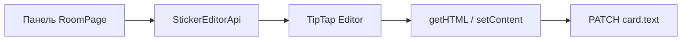

# TipTap в редакторе стикера

**Статус:** выполнено (P3). Движок — [TipTap](https://tiptap.dev/) (MIT-расширения из npm).

## Что сделано

- `client/src/components/StickerTipTapField.tsx` — поле редактирования на `@tiptap/react`
- `client/src/lib/stickerTipTap/` — extensions, commands, API, node для `@упоминаний`
- `RoomPage.tsx` — панель форматирования вызывает `editor.chain()` вместо `document.execCommand`
- **`Card.text`** по-прежнему **HTML** (обратная совместимость API и отчётов)

## Архитектура

## Доработки в ветке TipTap (технический хвост)

- Undo/redo панели — история TipTap (`History` в StarterKit), без дублирующих HTML-стеков
- Таблицы: вставка и строки/столбцы — команды `@tiptap/extension-table`; merge/split — DOM + `syncFromDom`
- @упоминания — `insertContent` через `mentionInsert.ts`
- Код-блок — `toggleCodeBlock` вместо сырого `<pre>`
- Lazy-load редактора — `StickerTipTapFieldLazy`
- Убраны вызовы `document.execCommand` на панели

## Не в scope (отдельные ветки)

См. [TIPTAP_FUTURE.md](./TIPTAP_FUTURE.md):

- JSON-документ вместо HTML (бэклог §10)
- Совместное редактирование текста в одном стикере (CRDT)
- TipTap Pro / Cloud

## Проверка вручную

1. Открыть стикер двойным кликом — набор текста, жирный/курсив/списки
2. `@` — автокомплит, вставка mention-span
3. Ссылка, подсветка, таблица, PNG
4. Сохранение на сервер (blur / Esc) — перезагрузка страницы, текст на месте

См. [STICKER_EDITOR_BACKLOG.md](./STICKER_EDITOR_BACKLOG.md) § P3.
